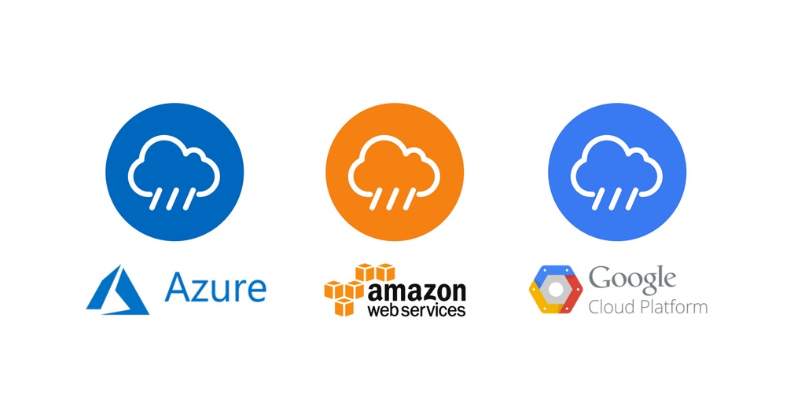
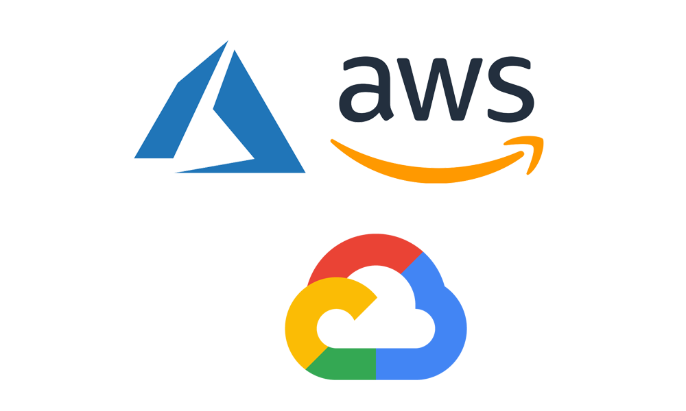

# MULTI-CLOUD

Há razões extremamente convincentes para que o multicloud esteja se mostrando o jogo final. Ser multicloud oferece grande agilidade e economia com sua flexibilidade para separar diferentes cargas de trabalho em diferentes ambientes, dependendo de seus requisitos específicos. Isso inclui uma estratégia local atraente e economicamente comparável para a nuvem e abre novas oportunidades para inovação e implementação acelerada de novos serviços para os clientes. Multicloud também significa que as empresas podem evitar o aprisionamento do fornecedor e a dependência de um único provedor. Embora as preocupações persistentes sobre multicloud sejam compreensíveis, uma série de tecnologias mais recentes como o Kubernetes e a consolidação crescente dos tempos de execução do contêiner estão facilitando a vida das empresas que precisam transformar multicloud em sua estratégia de fato.

O que alguns especialistas dizem:

*James Sanders, TechRepublic*

Multi-nuvem capacita os desenvolvedores a escolher os melhores componentes para seus casos de uso - imagine uma situação em que você deseja usar o AWS Lambda para tratamento de eventos voltados para o cliente, mas deseja pegar esses registros de eventos e analisá-los na análise de dados do Google Cloud Platform Serviços. Esses tipos de implantações em várias nuvens permitem que os desenvolvedores aproveitem os pontos fortes em diferentes plataformas de nuvem, bem como o ecossistema maior de integrações de terceiros para AWS Lambda que ainda não chegaram ao GCP Cloud Functions. Ao ter uma visão ativa do que está disponível - não apenas quais recursos uma plataforma de nuvem pública oferece - você mantém mais propriedade de sua plataforma.

*Carl Brooks, 451 Research*

“As empresas devem usar uma estratégia de nuvem múltipla porque esta abordagem oferece uma gama de opções para alavancar com eficiência os benefícios de diferentes plataformas. Por exemplo, um aplicativo legado preso em uma pilha LAMP tradicional é uma oportunidade perdida se o resultado pudesse ser alcançado com mais eficiência em uma nuvem pública. Da mesma forma, as nuvens privadas oferecem seu próprio conjunto de vantagens (recursos dedicados, customização), combinadas com a flexibilidade e agilidade da Infraestrutura como Serviço. Combinar e combinar diferentes plataformas e serviços é facilmente alcançável graças às APIs e à virtualização generalizada, e só conseguirá ainda mais. A nuvem múltipla também é uma parte da TI que se normaliza rapidamente. Hoje, cerca de dois terços das empresas têm mais de um provedor ou plataforma IaaS, e o mesmo número considera que uma estratégia de TI híbrida unificada é o melhor caminho a seguir para cargas de trabalho legadas e nativas da nuvem. As empresas que não conseguirem modernizar sua TI em uma estrutura multi-nuvem / híbrida serão deixadas para trás, pura e simplesmente. ”

*Dale Vile, Freeform Dynamics*

O uso de várias plataformas e serviços em nuvem é um fato da vida para a maioria das empresas convencionais, mas o acúmulo de nuvens de maneira ad-hoc leva a uma fragmentação cara e arriscada. Torna-se cada vez mais difícil controlar as despesas gerais, gerenciar a segurança e atender aos requisitos de negócios e operacionais de maneira mais geral. É por isso que uma abordagem de várias nuvens mais coordenada é tão importante. Com a combinação certa de estratégia, processo, disciplina e tecnologia de suporte, você pode lidar com muitos dos desafios e, ao mesmo tempo, desfrutar do tipo de escolha e flexibilidade necessária no ambiente digital em constante mudança de hoje. ”

*Devan Adams, IHS Markit*

“O uso de nuvens múltiplas é fundamental para organizações que desejam evitar o aprisionamento do provedor de serviços em nuvem (CSP). Uma estratégia de nuvem múltipla permite que as empresas usem os melhores serviços em nuvem de uma infinidade de provedores de serviços no mercado, por exemplo, computação da AWS, serviços de contêineres da nuvem do Google e SaaS da SAP.

O uso de várias nuvens é uma tendência de crescimento rápido que destacamos em nossa pesquisa realizada recentemente - Pesquisa de estratégias e liderança de serviços em nuvem na América do Norte - 2018, onde os entrevistados relataram que estavam usando 10 CSPs diferentes para SaaS (crescendo para 14 em 2020) e 10 para infraestrutura (crescendo para 13 até 2020). Os CSPs estão ajudando a facilitar o uso de várias nuvens, lançando ferramentas de gerenciamento de várias nuvens para as organizações usarem para visualizar e gerenciar várias nuvens a partir de uma ferramenta de painel.

Não usar uma abordagem de várias nuvens torna as empresas totalmente dependentes de um CSP para todos os seus serviços relacionados à nuvem, alguns dos quais podem não oferecer o melhor valor ou serviço. Além disso, as organizações que não usam serviços em nuvem de mais de um provedor são limitadas no avanço de seus serviços, à medida que novas tecnologias e tendências ocorrem no mercado, as empresas podem atrasar o uso de novas ferramentas se os CSP que usam forem adotantes lentos. ”

*Jean Bozman, Hurwitz & Associates*

“Existem muitos caminhos para várias nuvens - não apenas um movimento ousado para forjar uma nova estratégia de várias nuvens. A maioria das grandes empresas tem infraestrutura de computador local que é o resultado de muitas ondas de investimentos e implantações ao longo de décadas de gastos. A jornada para a nuvem múltipla está evoluindo, à medida que as empresas estão adotando uma variedade de serviços em nuvem para atender a desafios de negócios específicos, enquanto reduzem seus custos de TI para data centers locais. Em grandes empresas, algumas unidades de negócios podem ter optado por hospedar novamente um grande número de sistemas no AWS da Amazon ou no Microsoft Azure. Outros podem ter escolhido o Google Cloud Platform (GCP) por sua experiência em AI / ML por meio de análises baseadas no TensorFlow. Ao adotar uma abordagem de várias nuvens, os clientes corporativos ganham escolha, flexibilidade operacional - e a liberdade de escolher serviços CSP para a combinação ideal de negócios, segurança e considerações de custo.

## Por que as organizações escolhem uma estratégia multicloud

“A maioria das organizações adota uma estratégia multicloud pelo desejo de evitar o aprisionamento do fornecedor ou de tirar proveito das melhores soluções da categoria”, diz ele. “Esperamos que a maioria das grandes organizações continue a perseguir essa abordagem deliberadamente.”

O Gartner prevê que os 10 maiores provedores de nuvem pública comandarão, no mínimo, metade do mercado total de nuvem pública até pelo menos 2023.

Conheça os motivadores da decisão
As decisões de computação em várias nuvens geralmente baseiam-se em três considerações:

- Sourcing: O desejo de aumentar a agilidade e evitar ou minimizar o aprisionamento do fornecedor. A decisão pode ser orientada por uma variedade de fatores, incluindo disponibilidade, desempenho, soberania dos dados, requisitos regulatórios e custos de mão de obra.
- Arquitetura: os aplicativos modernos são, por design, criados em um estilo mais modular. Eles podem abranger vários provedores de nuvem ou consumir serviços de várias nuvens.
- Governança: para garantir o controle operacional, as empresas desejam unificar a administração e o monitoramento de seus sistemas de TI. Eles querem padronizar políticas, procedimentos e processos e compartilhar algumas ferramentas - especialmente aquelas que permitem a governança e otimização de custos - entre vários provedores de nuvem.

Os benefícios do multicloud citados pelos clientes incluem melhor recuperação de desastres e migração mais fácil para alguns dados e aplicativos.

Por que escolher um único provedor?
As exceções mais comuns à tendência multicloud são as organizações que concentram seus investimentos em uma pilha de tecnologia de um único fornecedor. Alguns acham difícil justificar o esforço e o custo de trabalhar com vários provedores de nuvem.

É aconselhável não pular diretamente de implantações em nuvem locais para vários fornecedores, diz Warrilow.

“Existem muitas nuances entre as plataformas, e tentar construir serviços em mais de uma simultaneamente é um desafio”, diz ele. “Começar devagar também permite que a equipe interna desenvolva suas habilidades e aprenda a gerenciar a nuvem.”

## 10 benefícios em ser multi-cloud

Vou listar abaixo os 10 principais benefícios comerciais em ser mutlcloud. Isso o ajudará a entender os fundamentos das aplicações multicloud para que você também possa obter uma distribuição ideal de ativos em seus ambientes cloud. 

### 1. Capacidade de encontrar os melhores provedores de nuvem
Ao incorporar várias nuvens à estratégia de TI de uma empresa, os administradores podem alinhar seus requisitos de negócios com os melhores provedores de hospedagem em nuvem para cada tarefa individual. Por exemplo, você pode selecionar um provedor de nuvem com base em sua alta velocidade de upload, enquanto outro provedor pode garantir termos de Acordo de Nível de Serviço mais favoráveis. Por ter várias opções, os usuários podem atingir um alto nível de agilidade e combinar cada parte de seus negócios com os termos de configuração e execução de um provedor específico. Em vez de dobrar seus processos para acomodar os requisitos de um fornecedor, você tem a liberdade de acessar várias opções, cada uma oferecendo a melhor correspondência para diferentes partes do seu negócio.

### 2. Preços competitivos
Conforme o número de provedores de nuvem múltipla cresce, eles formam um mercado competitivo que se esforça para oferecer preços ideais para diferentes capacidades de recursos, ao mesmo tempo que permanece atraente para a maioria dos usuários da nuvem. Com isso em mente, as organizações agora podem desfrutar da liberdade de comparar diferentes provedores e garantir as melhores taxas disponíveis com base em suas necessidades de TI específicas. E como você não está limitado aos termos de nenhum único provedor de nuvem, pode selecionar o melhor fornecedor com base em suas ofertas, como flexibilidade de pagamento, contratos ajustáveis, capacidade personalizável e outros elementos importantes.

### 3. Agilidade
O planejamento de uma estratégia de várias nuvens não é uma tarefa fácil. Muitas empresas tradicionais ainda lutam com sistemas de TI legados, estruturas locais e fornecedores de hardware. Eles são frequentemente limitados em sua capacidade de orquestrar operações em várias nuvens por conta própria, portanto, procuram provedores de serviços competentes que devem fornecer a experiência necessária para a adoção de infraestruturas em várias nuvens. Com o conhecimento certo em mãos, você será capaz de obter agilidade completa e mobilidade de carga de trabalho entre plataformas heterogêneas de nuvem, armazenamento e hipervisores.

### 4. Resiliência reforçada
Um arranjo de várias nuvens também pode ajudar a proteger os aplicativos e dados críticos de negócios de uma empresa, oferecendo recursos redundantes de backup e recuperação que fornecem continuidade de negócios quando ocorre uma emergência, seja causada por uma falha de disco, queda de energia ou desastre natural. Adicionar uma peça com várias nuvens à sua estratégia de recuperação de desastre fornece um nível muito necessário de confiabilidade e segurança, oferecendo a capacidade de replicar seus recursos em uma região de nuvem longe da área de desastre.

### 5. Flexibilidade e escalabilidade
Com 90% dos dados mundiais sendo criados apenas nos últimos dois anos, a nuvem múltipla oferece um lugar perfeito para processar e armazenar informações com automação adequada e sincronizações em tempo real. a nuvem múltipla é uma solução perfeita não apenas para armazenamento, mas também para escalabilidade, pois permite que as empresas aumentem ou diminuam o armazenamento com base em uma demanda contínua. Idealmente, os provedores de nuvem múltipla trabalham perfeitamente juntos para que as organizações possam investir em qualquer nível de espaço, segurança e proteção com base nas necessidades de cada segmento de dados.

### 6. Segurança robusta
Como os provedores de nuvem são responsáveis ​​pela segurança de suas próprias infraestruturas, eles podem garantir que sua organização tenha todos os recursos necessários para proteger seus dados também. Certifique-se de entender completamente como todas as entidades em seu ambiente de nuvem são compatíveis com os aplicativos de nuvem à sua disposição. A segurança de sua rede deve ser avaliada regularmente conforme sua infraestrutura e software mudam com o tempo.

### 7. Melhorias de desempenho de rede
a interconexão de várias nuvens permite que você crie uma infraestrutura de alta velocidade e baixa latência enquanto reduz o custo de integração de nuvens com seu sistema de TI existente. Ao permitir que as empresas estendam suas redes para vários provedores, uma abordagem de nuvem múltipla aproveita a proximidade e usa conexões rápidas de baixa latência para melhorar significativamente o tempo de resposta do aplicativo, proporcionando uma melhor experiência do usuário. Uma interconexão altamente otimizada só pode ser alcançada por meio de links privados mais rápidos entre vários provedores de serviços em nuvem.

### 8. Gerenciamento de risco aprimorado
O gerenciamento de riscos é outra grande vantagem que vem com a adoção de uma estratégia de várias nuvens. Se acontecer de um fornecedor ter um colapso da infraestrutura ou um ataque, um usuário de várias nuvens pode mudar rapidamente para outro provedor de serviços de nuvem ou fazer backup para uma nuvem privada. provedores de nuvem múltipla podem reduzir o risco empregando sistemas redundantes e independentes que oferecem mecanismos de autenticação robustos, teste de vulnerabilidade e consolidação de ativos de API. Mas, em última análise, a única maneira de garantir um sistema de gerenciamento de risco robusto é implementar uma abordagem de segurança em várias camadas.

### 9. Evitando o aprisionamento do fornecedor
Muitas empresas estão familiarizadas com a dependência de fornecedores por lidar com empresas corporativas tradicionais como a Oracle. Quando as organizações entram em um relacionamento com um provedor de serviços de nuvem sem avaliar cuidadosamente as regras relacionadas a custos e add-ons primeiro, elas percebem rapidamente que certos termos e condições não podem ser alterados. Avaliando cuidadosamente as expectativas e potenciais armadilhas e tendo uma forte posição de negociação que facilita a troca de um provedor de nuvem para outro, as empresas podem aproveitar o poder da nuvem e obter o máximo valor de sua parceria com qualquer provedor de serviços em nuvem .

### 10. Impulsiona a inovação
Por meio da automação do processo de gerenciamento de várias nuvens, as empresas podem coordenar com eficácia cargas de trabalho distintas, gerenciar fluxos de trabalho híbridos e integrar os processos de DevOps para impulsionar a inovação. A automação garante uma orquestração eficiente de dados, aplicativos e infraestrutura em vários ambientes de nuvem. Ele expande os recursos de implantação, conectando aplicativos e processos de fluxo de trabalho para fornecer serviços de negócios rapidamente.

# Referências

## Multi-cloud
https://www.cloudindustryforum.org/content/five-reasons-why-multi-cloud-infrastructure-future-enterprise-it
https://ubuntu.com/blog/why-multi-cloud-has-become-a-must-have-for-enterprises-six-experts-weigh-in
https://www.gartner.com/smarterwithgartner/why-organizations-choose-a-multicloud-strategy/
https://www.acronis.com/en-us/articles/top-10-benefits-of-multi-cloud/
