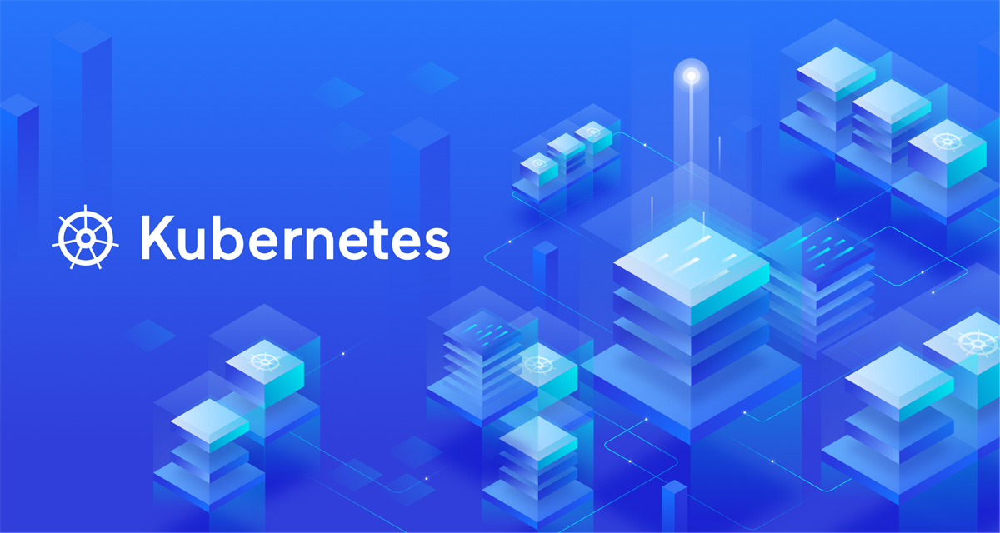
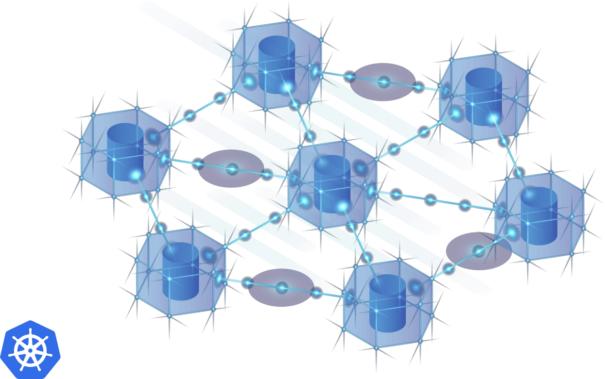

# MULTI-CLUSTER

## O que é Multi-Cluster?

Multi-cluster é uma estratégia para implantar um aplicativo em ou entre vários clusters do Kubernetes com o objetivo de melhorar a disponibilidade, o isolamento e a escalabilidade. O multicluster pode ser importante para garantir a conformidade com regulamentações diferentes e conflitantes, pois os clusters individuais podem ser adaptados para cumprir regulamentações geográficas ou específicas de certificação. A velocidade e a segurança da entrega de software também podem ser aumentadas, com equipes de desenvolvimento individuais implantando aplicativos em clusters isolados e expondo seletivamente quais serviços estão disponíveis para teste e lançamento.

## Por que Multi-Cluster?

Noções básicas sobre Kubernetes multicluster...
As organizações estão cada vez mais implantando vários clusters Kubernetes para melhorar a disponibilidade, o isolamento e a escalabilidade.

Hoje, as organizações estão cada vez mais implantando muitos mais clusters Kubernetes e tratando esses clusters como descartáveis. Várias organizações falaram na KubeCon sobre “tratar os clusters como gado, não como animais de estimação”. Essa abordagem resulta em vários benefícios.

### Prontidão operacional aprimorada
Ao padronizar a criação de cluster, os runbooks operacionais associados, solução de problemas e ferramentas são simplificados. Isso elimina fontes comuns de erros operacionais, ao mesmo tempo que reduz a carga cognitiva para engenheiros de suporte e SREs, o que acaba levando a um tempo de resposta geral aprimorado para problemas.

### Isolamento e multilocação
As garantias de forte isolamento simplificam os principais processos operacionais, como cluster e atualizações de aplicativos. Além disso, o isolamento pode reduzir o raio de explosão de uma interrupção do cluster. Organizações com fortes requisitos de isolamento de locação podem encaminhar cada locatário para seu cluster individual.

### Maior disponibilidade e desempenho
O multicluster permite que os aplicativos sejam implantados em ou entre várias zonas e regiões de disponibilidade, melhorando a disponibilidade do aplicativo e o desempenho regional para aplicativos globais.

### Conformidade
Os aplicativos em nuvem hoje precisam cumprir uma infinidade de regulamentos e políticas. É improvável que um único cluster seja capaz de cumprir todas as regulamentações. Uma estratégia de vários clusters reduz o escopo de conformidade para cada cluster individual.

### Elimine o aprisionamento do fornecedor
Uma estratégia de vários clusters permite que sua organização mude as cargas de trabalho entre diferentes fornecedores do Kubernetes para aproveitar os novos recursos e preços oferecidos por diferentes fornecedores.

# Multi-Cluster Application Architecture

Multi-cluster applications can be architected in two fundamental ways:

## Replicado - implantação única

Neste modelo, cada cluster executa uma cópia completa do aplicativo. Essa abordagem simples, mas poderosa, permite que um aplicativo seja dimensionado globalmente, pois o aplicativo pode ser replicado em várias zonas de disponibilidade ou datacenters e o tráfego do usuário é roteado para o cluster mais próximo ou mais apropriado. Juntamente com um balanceador de carga global com reconhecimento de integridade, essa arquitetura também permite o failover; se um cluster parar de funcionar ou deixar de responder, o tráfego do usuário será roteado para outro cluster.

## Dividido por serviço - implantação distribuída

Nesse modelo, os serviços de um único aplicativo ou sistema são divididos em vários clusters. Essa abordagem fornece um isolamento mais forte entre as partes do aplicativo em detrimento de uma maior complexidade. Esse padrão é frequentemente usado para facilitar a conformidade com os requisitos regulamentares. Por exemplo, serviços compatíveis com PCI DSS e infraestrutura de suporte podem ser localizados em um único cluster, e os clusters de aplicativos restantes podem ser operados fora desse escopo. Esse padrão também facilita a velocidade e a segurança durante o desenvolvimento e a entrega do aplicativo, pois as equipes de desenvolvimento individuais podem implementar seus serviços específicos em seu próprio cluster sem impactar outras equipes.

## Configurando Kubernetes multicluster
O Kubernetes multicluster tem um escopo amplo, com uma infinidade de desafios e abordagens. As abordagens gerais podem ser agrupadas livremente em duas categorias:

## Kubernetes multicluster do mundo real
Qual estratégia de vários clusters você deve escolher? Em meados de 2020, a maioria das organizações que adotam vários clusters estão avaliando as abordagens centradas na rede. Os principais motivos para essa tendência são a falta de maturidade no projeto de Federação e o fato de que uma abordagem GitOps para o gerenciamento de configuração se tornou de rigueur para usuários do Kubernetes. Uma abordagem GitOps, juntamente com alguma automação básica, se presta facilmente ao gerenciamento de vários clusters, pois cada cluster pode ser criado a partir de uma configuração padronizada. Portanto, um plano de gerenciamento centralizado não reduz a sobrecarga de gerenciamento de forma proporcional à complexidade que ele apresenta.

Das abordagens centradas na rede, todas as abordagens listadas acima requerem a adoção de uma malha de serviço. Assim, decidir entre as abordagens requer avaliar malhas de serviço em geral, além das capacidades específicas de cada malha. 

Um breve resumo de cada uma das abordagens está abaixo:

# Referências

## Multi-cluster
https://www.getambassador.io/learn/multi-cluster-kubernetes/
https://kubernetes.io/blog/2016/09/deploying-to-multiple-kubernetes-with-kit/
https://acloudguru.com/blog/engineering/why-and-how-do-we-build-a-multi-region-active-active-architecture
https://medium.datadriveninvestor.com/a-multi-cloud-and-multi-cluster-architecture-with-kubernetes-cb3abe554948
https://www.alibabacloud.com/blog/a-multi-cloud-and-multi-cluster-architecture-with-kubernetes_595541?spm=a2c41.13705838.0.0
